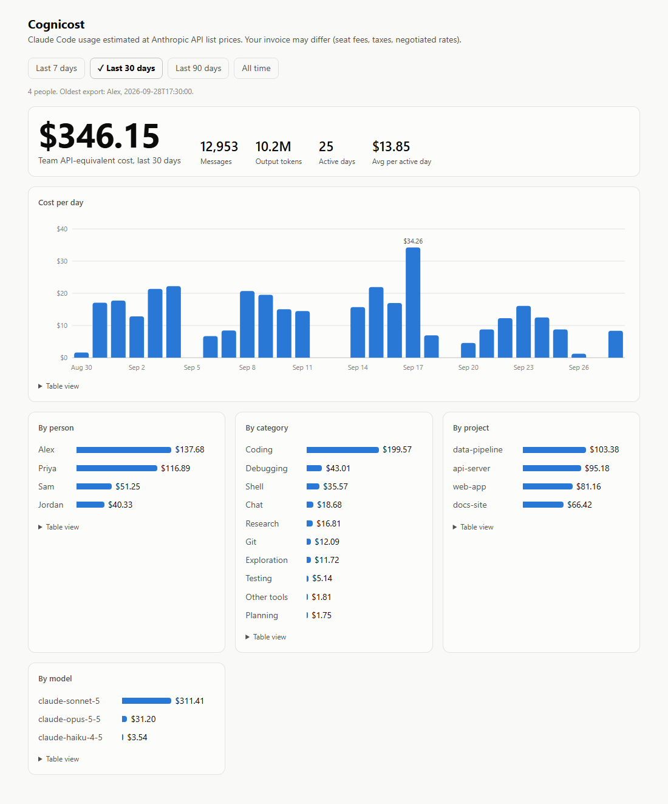

# Cognicost

Shows what your Claude Code usage would cost at Anthropic API list prices. Reads the session logs Claude Code already
writes to `~/.claude/projects` (or `$CLAUDE_CONFIG_DIR`). Nothing leaves your machine. Python 3.9+, no dependencies.

*The `--web` dashboard in team mode. Sample data for a made-up four-person team, not real usage.*

## Install

Needs Python 3.9 or newer on Windows. Recommended, so it gets its own isolated environment and a `cognicost` command:

    pip install pipx && pipx ensurepath        # once; then open a new terminal
    pipx install git+https://github.com/originalgbm/cognicost
    pipx upgrade cognicost                     # later, to pick up a new version

Without pipx: `pip install git+https://github.com/originalgbm/cognicost`, or clone the repo and run
`python -m cognicost` from it with no install at all.
`--update-prices` rewrites the prices file inside the installed copy, so an upgrade resets it to the bundled prices.

## Use

    cognicost                        # last 30 days, by day
    cognicost --by project --days 7
    cognicost --by model --days 0    # all time
    cognicost --web                  # browser dashboard at http://127.0.0.1:8787 (--port to change)
    cognicost --by category          # Coding, Debugging, Testing, ... (see below)
    cognicost --by session
    cognicost --update-prices        # refresh cognicost/prices.json from LiteLLM

**Team roll-up** (opt-in, nothing is shared unless you run the export yourself):

    cognicost --export \\server\share\cognicost           # each person; any shared or synced folder works
    cognicost --export <folder> --name "Folder Name"      # name shown in the roll-up (default: Windows username)
    cognicost --team <folder>                             # anyone with folder access: combined table
    cognicost --team <folder> --by user                   # per person
    cognicost --team <folder> --web                       # dashboard with a "By person" card

`--export` writes one plain JSON file per person and re-running it overwrites that file, so run it whenever you want
to refresh your numbers. It covers your whole history (the viewer picks the date range). Open it first if you want to
see exactly what leaves your machine: per day, model, category and **project name**, the message count and token
counts. No prompts, code, or file paths. Everyone who can read the folder can see everyone's file, names included.
Costs are computed by whoever views the roll-up, using their copy of `prices.json`. If someone changes their `--name`,
delete their old file or they are counted twice. The viewer shows the oldest export so stale data is visible.

**The dashboard** is one HTML file served from your own machine only (127.0.0.1, so nobody else on the network can
reach it; requests with a foreign Host header are refused). It loads no libraries and makes no network calls.
Ctrl+C in the terminal stops it.

**Categories** are a deterministic guess, no AI involved. A turn is one of your prompts plus everything Claude did until
your next prompt; the whole turn gets one label, first match wins: Debugging (prompt says fix/bug/error/crash... and
Claude edited files or ran commands) > Coding (edited files) > Testing (ran a test command) > Git > Planning >
Research (web) > Shell > Exploration (read-only) > Other tools > Chat. Rules live in `classify()`.

**WSL:** if you also run Claude Code inside WSL, its logs live in the Linux home folder. Cognicost finds them through
`\\wsl.localhost\<distro>\home\<user>\.claude` and adds them to your totals (it says which paths it used). Two things
to know: looking there starts a stopped distro, so pass `--no-wsl` to skip it, and Docker Desktop's internal distros
are ignored. Use `--root <path>` to point at one specific logs folder instead.

**The dollar figure is an estimate:** tokens x Anthropic API list price. On a usage-based Enterprise plan tokens are
billed at API rates, so it approximates your organization's bill, but it leaves out seat fees and taxes and won't match
a contract with negotiated rates. (On a Pro/Max subscription you aren't billed per token at all, so there it only
shows how much usage you got.)
